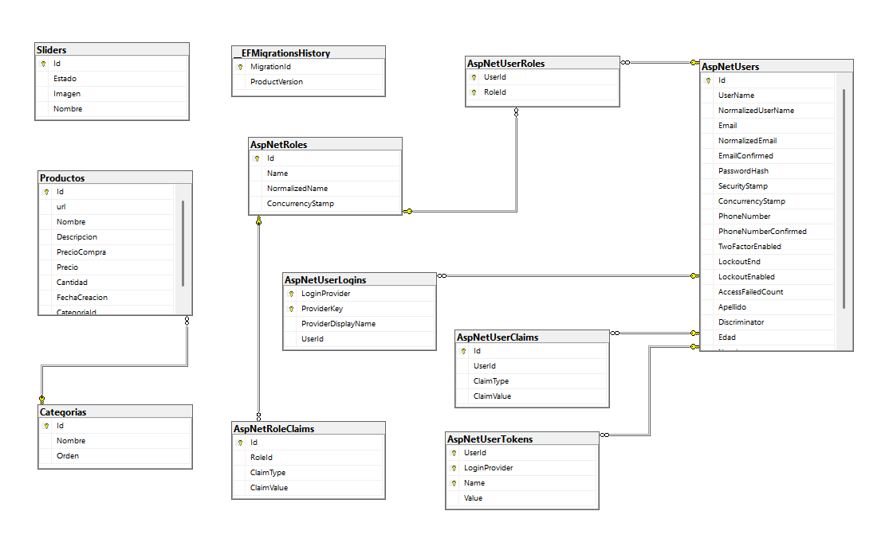

# InventarioSuper 2.0

Sistema de gestión de inventario para supermercados desarrollado con ASP.NET Core y Entity Framework.

## 📋 Descripción

InventarioSuper es una aplicación web moderna para la administración integral de inventario, categorías de productos, gestión de usuarios y colaboradores. Proporciona un panel de control administrativo y vistas personalizadas según el rol del usuario.

## 🛠️ Tecnologías Utilizadas

- **Backend:** ASP.NET Core (MVC)
- **Base de Datos:** SQL Server / Entity Framework Core
- **Frontend:** HTML, CSS, JavaScript
- **Autenticación:** ASP.NET Core Identity
- **Editor de Contenido:** TinyMCE
- **Control de Versiones:** Git

## 📁 Estructura del Proyecto

```
InventarioSuper/
├── InventarioSuper/              # Aplicación Principal (MVC)
│   ├── Areas/                    # Áreas especializadas
│   │   ├── Admin/               # Panel de administración
│   │   ├── Colaborador/         # Funcionalidades para colaboradores
│   │   ├── Identity/            # Autenticación y autorización
│   │   └── Usuarios/            # Gestión de usuarios
│   ├── Views/                   # Vistas compartidas
│   ├── wwwroot/                 # Archivos estáticos
│   │   ├── css/                # Estilos CSS
│   │   ├── js/                 # Scripts JavaScript
│   │   ├── lib/                # Librerías cliente
│   │   └── Imagenes/           # Imágenes de productos y sliders
│   └── Program.cs              # Configuración de la aplicación
├── InventarioSuperDatos/        # Capa de Datos (DbContext, Migrations)
├── InventarioSuperModelos/      # Modelos y ViewModels
└── InventarioSuperUtilidades/   # Utilidades y constantes
```
## Base de datos



## 🔑 Características Principales

- **Gestión de Productos:** Crear, editar, eliminar y visualizar productos del inventario
- **Gestión de Categorías:** Organizar productos por categorías
- **Sistema de Sliders:** Gestor de imágenes para carrusel en la página de inicio
- **Gestión de Usuarios:** Control de usuarios y asignación de roles
- **Control de Acceso por Roles:** Admin, Colaborador, Usuario
- **Panel Administrativo:** Dashboard completo para administradores
- **Interfaz Responsive:** Diseño adaptable a diferentes dispositivos

## 🗄️ Modelos Principales

### Producto
- Id, Nombre, Descripción, Precio, Foto
- Relación con Categoría

### Categoria
- Id, Nombre, Descripción

### Slider
- Id, Nombre, Imagen, Descripción, Estado

### Usuario
- Id, Nombre, Email, Rol, Estado

## 📦 Instalación y Configuración

### Requisitos Previos
- .NET 6.0 o superior
- SQL Server 2019 o superior
- Visual Studio 2022 (recomendado)

### Pasos de Instalación

1. **Clonar el repositorio**
```bash
git clone <url-del-repositorio>
cd Inventario2.0
```

2. **Restaurar dependencias**
```bash
dotnet restore
```

3. **Configurar la cadena de conexión**
Editar `appsettings.json` con los datos de tu base de datos:
```json
{
  "ConnectionStrings": {
    "DefaultConnection": "Server=YOUR_SERVER;Database=InventarioDB;Trusted_Connection=true;"
  }
}
```

4. **Aplicar migraciones**
```bash
cd InventarioSuperDatos
dotnet ef database update
```

5. **Ejecutar la aplicación**
```bash
cd ../InventarioSuper
dotnet run
```

La aplicación estará disponible en `https://localhost:7000` (o el puerto configurado)

## 👥 Roles y Permisos

| Rol | Permisos | Acceso |
|-----|----------|--------|
| **Admin** | Acceso completo al sistema | Todas las áreas incluyendo gestión de usuarios |
| **Colaborador** | Gestión de productos | Área Colaborador |
| **Usuario** | Visualización de catálogo | Página pública |

## 📝 Configuración de Base de Datos

El proyecto utiliza Entity Framework Core con migraciones. Las migraciones registradas incluyen:

- Identity Schema
- Modelo Categoría
- Modelo Producto
- Gestión de Fotos
- Tabla Sliders
- Gestión de Usuarios

Para crear una nueva migración:
```bash
dotnet ef migrations add NombreMigracion --project InventarioSuperDatos
dotnet ef database update --project InventarioSuperDatos
```

## 🎨 Personalización

### Estilos
Los estilos CSS se encuentran en `wwwroot/css/site.css`

### JavaScript
Funcionalidades especializadas en:
- `Producto.js` - Gestión de productos
- `EditorTinyMce.js` - Configuración del editor de contenido
- `Categoria.js` - Gestión de categorías

### Imágenes
Las imágenes estáticas se organizan en:
- `wwwroot/Imagenes/Productos/` - Fotos de productos
- `wwwroot/Imagenes/Sliders/` - Imágenes del carrusel

## 🚀 Deployment

### Publicar en Producción
```bash
dotnet publish -c Release
```

## 📧 Contacto y Soporte

Para reportar problemas o sugerencias, por favor crea un issue en el repositorio.

## 📄 Licencia

Este proyecto está bajo licencia MIT.

---

**Última actualización:** Febrero 2026
